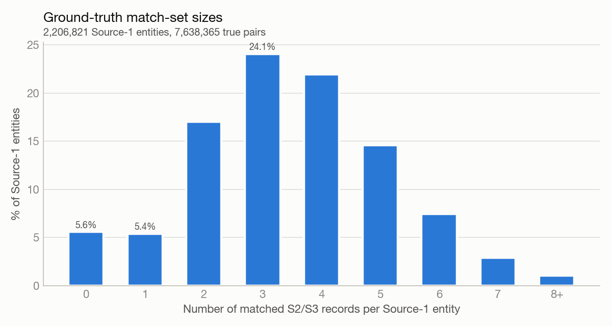
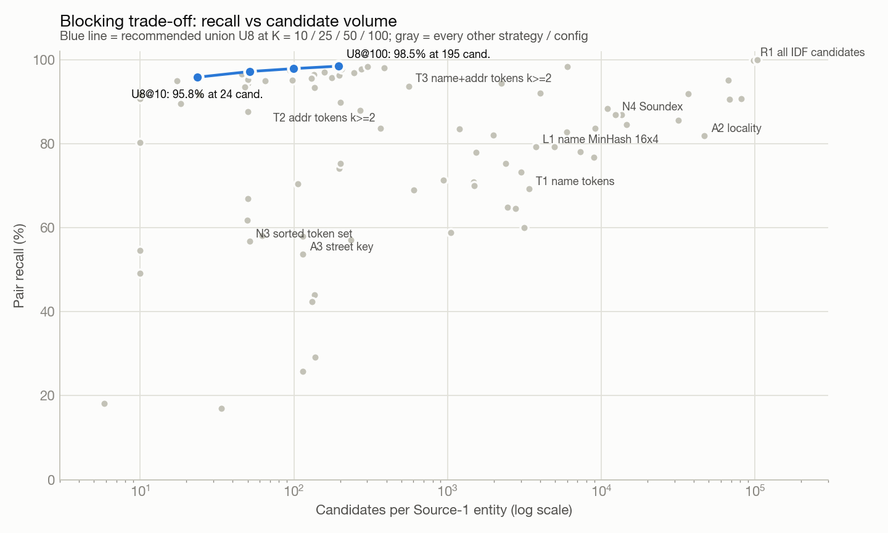
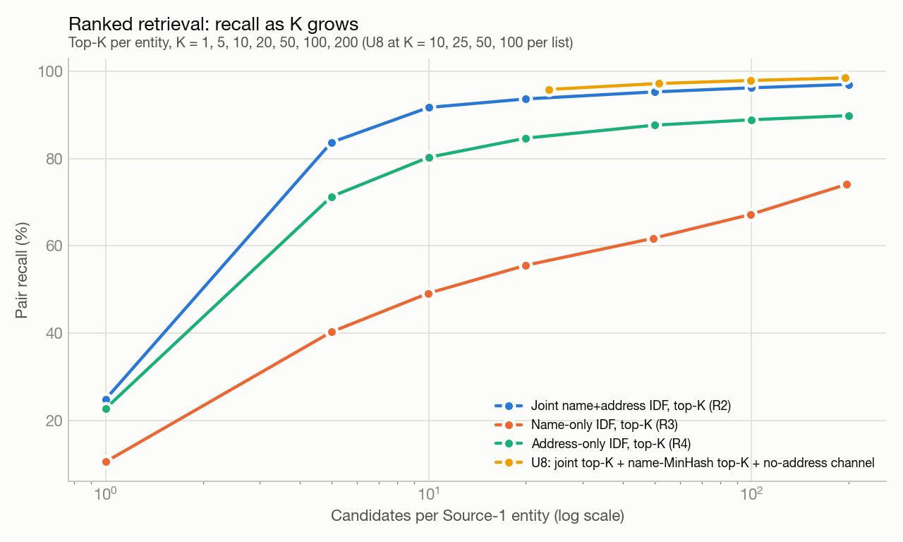
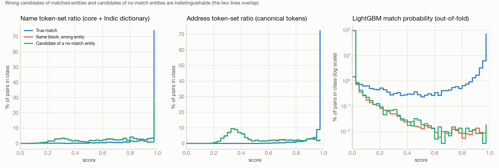
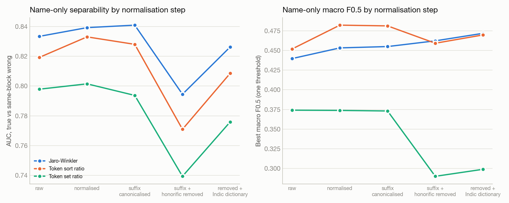

# Business entity resolution: EDA, blocking and similarity study

All numbers come from the provided training files, except §1.6, which profiles the *unlabelled* test files to check formats for France. Nothing external was looked up. The pretrained embedding models used in §3.4 are Apache-2.0 sentence encoders with 22.7M and 118M parameters.

- **Profiling** uses every record: 2.2M Source 1 (S1), 5.03M Source 2 (S2) and 5.29M Source 3 (S3).
- **Blocking** is evaluated for 20,000 random S1 entities against the **full** S2+S3 corpus (10.32M records). Block sizes, candidate counts and reduction ratios are therefore exact for the real corpus size. The sample holds 68,931 true pairs and 1,102 singletons.
- **Similarity** uses the candidate pairs of 4,000 random S1 entities, plus all 1,102 singletons of the sample (for singleton statistics).

The full tables are in [`results/REPORT_TABLES.md`](results/REPORT_TABLES.md) and the charts in [`results/figures/`](results/figures). The scripts are listed at the end.

---

## 1. Data profiling

### 1.1 Volume, countries, missing fields

| Source | US | India | Empty address | NULL / N/A placeholder in address |
|---|---|---|---|---|
| S1 (reference) | 1,323,633 | 883,188 | 0% | 0% |
| S2 | 3,016,817 | 2,017,799 | 3.7% / 2.9% | 3.9% / 2.9% |
| S3 | 3,170,056 | 2,115,547 | 3.5% / 3.1% | 3.7% / 2.8% |

- `country` is never missing. It is identical for **100%** of the 7.64M true pairs, so no true match crosses a country label.
- Names are never empty.
- S1 is clean: all ASCII, no empty addresses, and one layout family.
- S2/S3 carry all of the noise.
- Test adds France: 259k S1 records (15%) and ~0.7M each in S2 and S3.

### 1.2 Lengths and formats

| | Name chars (median) | Name tokens / core tokens | Address chars (median) | Address components |
|---|---|---|---|---|
| US (S1 / S2 / S3) | 22 / 23 / 23 | 3 / 3 | 34 / 32 / 39 | 3 |
| India (S1 / S2 / S3) | 27 / 27 / 27 | 4 / 2 | 76 / 68 / 58 | 5 (p95: 8–9) |

- **US addresses** are `number street, city, ST`. 70% of S1 rows follow that order (81% counting a second number component). About 14% are systematically component-shuffled (NSA, ANS, SAN, ASN and SNA at ~2.8% each), and S2/S3 shuffle similarly. Parsing by position is therefore unsafe.
- **India addresses** have a variable number of locality components. 13% of S1 India addresses contain a landmark ("near", "opp") and 25% a flat/floor/unit reference. S2/S3 frequently drop or reorder components.
- **Postal codes are effectively absent.** A ZIP-like component appears in 0.05–0.2% of records and a 6-digit PIN in 0.01–0.1%, and many of those are unit numbers.
- **State** is always recoverable in S1 (100%) and in 96% of S2/S3 US rows. For S2/S3 India it drops to 72–75%, because 22–24% of India addresses write the state in an Indic script.

### 1.3 Name noise (S2/S3; S1 has almost none)

| Pattern | US S2 / S3 | India S2 / S3 |
|---|---|---|
| Legal suffix present | 50% / 49% | 58% / 65% |
| ALL CAPS | 21.6% / 3.2% | 14.9% / 2.6% |
| Honorific / prefix (Shri, Sri, Smt, Dr, M/s, The) | 1.3% / 1.6% | 8.1% / 8.9% |
| Domain-style (`xyz.com`, `www.`) | 4.4% / 4.2% | 3.4% / 3.7% |
| Single concatenated token ≥12 chars | 3.8% / 3.7% | 2.8% / 3.1% |
| Alias (`aka`, `dba`, `formerly`, `\|`) | 0.3% / 2.9% | 0.3% / 1.9% |
| Injected accents (Léarning, Sóciety) | 6.7% / 6.8% | 4.4% / 5.3% |
| **Indic-script name** | 0 | **23.5% / 13.2%** |

- **Indic-script names:**
  - They use nine scripts. Devanagari is 13.4% of S2 India; Telugu, Kannada, Tamil, Gujarati and Bengali are 1–2% each.
  - `unidecode` turns them into readable but distorted Latin: "फ्यूचर इन्वेस्टमेंट्स प्राइवेट लिमिटेड" becomes `phyuucr investtmentts praaivett limittedd`.
  - In S2 India, 23% of the true matches have an Indic-script name.
- **Transliteration dictionary:** aligning token-for-token with the matching S1 names yields a clean 760-entry dictionary, learned from 546k aligned pairs outside the evaluation sample. Examples: `innnvesttmenntts → investments`, `paalaaji → balaji`, `pilttrs → builders`. That fixes most Indic tokens, because the vocabulary is small.

### 1.4 Duplicates and name reuse

| Share of records in a duplicate group | S1 | S2 | S3 |
|---|---|---|---|
| Exact raw name+address | 0% | 0.6–1.7% | 0.6–0.8% |
| Normalised name+address | 0% | 3.3–3.4% | 1.7–3.0% |
| Core address (non-empty) | 5.2–5.7% | 25–34% | 21–34% |
| Core name | **48–54%** | 50–53% | 48–51% |

- **S1 is deduplicated but names are heavily reused across different entities.** 25% of S1 entities share their core name with at least 10 other S1 entities: "meridian" appears 575 times, "cedar" 352, "summit" 339. Many S1 name groups differ only by legal suffix and address, for example:
  - `Tabatha Stevenson Preferred Graphics LLC` at 5 different addresses;
  - `YUG Valley Bain LLC / Inc. / P.C. / LP`.
- **Name similarity alone therefore cannot resolve entities.** The address, and especially street, house number and city, must disambiguate.

### 1.5 Ground truth

| Match-set size | 0 (singleton) | 1 | 2 | 3 | 4 | 5 | 6 | 7 | 8+ |
|---|---|---|---|---|---|---|---|---|---|
| Share of S1 | **5.6%** | 5.4% | 17.0% | 24.1% | 21.9% | 14.6% | 7.5% | 2.9% | 1.1% |



- The ground truth has 7,638,365 true pairs: 3.69M to S2 and 3.94M to S3.
- The average match-set size is 3.67 among matched entities, with a maximum of 11. The distribution is **identical for US and India**, so it comes from the generator.
- **Every S2/S3 record belongs to at most one S1 entity**, so the task is one-to-many clustering. 89% of S1 entities have ≥ 2 matches.
- 87.0% of S1 entities have at least one S2 match and 87.9% at least one S3 match.
- 25–27% of S2/S3 records match nothing. These are distractors.
- **True pairs are noisy:**
  - core name identical: 52–54% (US 54–58%, India 49–50%);
  - canonical core address identical: 22–27% (US 28–34%, India 14–16%);
  - S2/S3 side has no address: 4.4%.

### 1.6 Does it generalise? (unlabelled test files: France)

- **The noise generator is the same.**
  - S2 ALL CAPS rate: 21%, as for US/India.
  - Domains 3.4%, concatenated names 3.2–3.4%, empty addresses ~3%, S3 aliases 1.3%.
  - The address shape is also the same: `number street, city, region`.
- **The US/India lexicons do not transfer:**
  - **Legal suffixes:** the US/India list catches only 0.1–0.3% of French names. The French forms are SARL (22–28%), SAS (16–20%), EURL, SASU, SA and SCI.
  - **Regions:** the US/India state lexicon matches 0% of French regions. S2/S3 swap region ↔ département (Hauts-de-France ↔ Nord, Nouvelle-Aquitaine ↔ Gironde) and drop the region in ~25% of rows.
  - **Abbreviations and stopwords:** street abbreviations are French (`R.` for rue is in 25% of S2/S3 addresses; `AV`). "de/la/du/des" appear in 99% of addresses.
- **Geography is concentrated.** Three regions cover all records, and Bordeaux, Nantes and Lille alone hold 43% of France records. City-level blocks would be even larger than in India.
- ⇒ **Use data-driven statistics per country**: document frequency / IDF, stop tokens learned from frequency, and learned dictionaries. Hard-coded lexicons should be optional helpers only, and blocking keys should never depend on them.

---

## 2. Blocking / candidate generation

**How it was measured.** Every strategy is scored for the same 20,000 S1 entities against all 10.32M S2/S3 records, using exact block sizes. Candidates must share at least `k` keys. Keys whose block exceeds the DF cap are dropped (block purging). All keys include the country unless stated otherwise.

The columns are:
- **Pair recall**: share of true pairs captured.
- **Entities fully covered**: every true match of the entity is captured.
- **F0.5 ceiling**: the macro F0.5 a perfect matcher could reach inside the candidate set. Singletons score 1 by predicting nothing.
- **Cand / S1**: mean candidates per S1 entity.
- **Reduction ratio**: RR = 1 − candidates / (|S1| × |S2 ∪ S3|).
- **False-candidate rate**: share of candidate pairs that are not true matches.

Every usable configuration has RR > 99.9%, because the full cross product is 2.3·10¹³ pairs. **Cand / S1 is therefore the cost number that separates strategies.**

### 2.1 Single strategies (one representative config each; all configs in `results/REPORT_TABLES.md`)

| Strategy | Pair recall | Entities fully covered | F0.5 ceiling | Cand / S1 | Reduction ratio | False-cand rate | Largest block |
|---|---|---|---|---|---|---|---|
| Name key: first 5 chars of core name (`N2.5`) | 82.7% | 58.8% | 0.927 | 5,972 | 99.9421% | 99.95% | 65,592 |
| Name key: first 4 chars, no suffix removal (`N1`) | 78.1% | 49.5% | 0.907 | 7,303 | 99.9292% | 99.96% | 70,256 |
| Name key: sorted token set, exact (`N3`) | 56.7% | 19.4% | 0.785 | 51 | 99.9995% | 96.16% | 1,682 |
| Phonetic: Soundex of first token (`N4`) | 86.9% | 63.7% | 0.954 | 12,405 | 99.8798% | 99.98% | 65,767 |
| Phonetic: sorted Metaphone set, exact (`N6`) | 58.1% | 20.6% | 0.795 | 62 | 99.9994% | 96.76% | 1,865 |
| Phonetic: ≥2 shared Metaphone codes (`N7`) | 71.3% | 43.9% | 0.838 | 942 | 99.9909% | 99.74% | 87,874 |
| Address: postal / PIN code (`A1`) | **0.1%** | 0.1% | 0.057 | 0.0 | 100.0000% | 70.31% | 187 |
| Address: city/locality component, cap 50k (`A2`) | 76.8% | 56.4% | 0.872 | 8,928 | 99.9135% | 99.97% | 44,651 |
| Address: street key = house no. + street word (`A3`) | 53.6% | 29.4% | 0.680 | 114 | 99.9989% | 98.38% | 9,987 |
| Address: first-line tokens, ≥2 shared (`A4`) | 57.9% | 36.8% | 0.690 | 114 | 99.9989% | 98.25% | 99,822 |
| Token index: name tokens ≥1, cap 10k (`T1`) | 69.2% | 49.2% | 0.783 | 3,401 | 99.9670% | 99.93% | 10,000 |
| Token index: name tokens ≥2 + Indic dictionary (`T1t`) | 78.0% | 50.8% | 0.890 | 1,528 | 99.9852% | 99.82% | 178,585 |
| Token index: address tokens ≥2, cap 20k (`T2`) | 83.7% | 64.5% | 0.917 | 367 | 99.9964% | 99.21% | 19,975 |
| **Token index: name+address tokens ≥2, cap 20k (`T3`)** | **93.7%** | 83.0% | 0.975 | 562 | 99.9946% | 99.42% | 19,975 |
| Token index: name+address tokens ≥4 (`T3`) | 87.9% | 67.7% | 0.954 | 269 | 99.9974% | 98.87% | 197,370 |
| MinHash LSH: name 3-grams, 16×4 bands (`L1`) | 79.2% | 51.7% | 0.909 | 3,768 | 99.9635% | 99.93% | 48,328 |
| MinHash LSH: name 3-grams, 32×2 (`L1`) | 90.7% | 78.4% | 0.959 | 81,580 | 99.2095% | 100.00% | 183,178 |
| MinHash LSH: address 3-grams, 16×4 (`L2`) | 83.5% | 61.0% | 0.931 | 1,189 | 99.9885% | 99.76% | 35,963 |
| MinHash LSH: address 3-grams, 10×6 (`L2`) | 70.5% | 40.5% | 0.854 | 107 | 99.9990% | 97.72% | 9,454 |

### 2.2 Ranked retrieval and unions: the recommended family

Instead of grouping by exact keys, these configs **score** every record that shares an informative token, then keep the top-K per S1 entity:

- **Joint name+address IDF retrieval (`R2`):** the score is the sum of IDF over shared name and address tokens, with the learned Indic dictionary applied to names.
- **Name-MinHash top-K:** ranked by the number of colliding bands; this catches typos and concatenated names.
- **No-address channel:** name-IDF top-10 among S2/S3 records that have no address.

| Candidate set | Pair recall | Entities fully covered | F0.5 ceiling | Cand / S1 | Reduction ratio | False-cand rate | Recall US / India | Recall on Indic-script matches | Recall on matches w/o address |
|---|---|---|---|---|---|---|---|---|---|
| Joint IDF retrieval, top-10 (`R2`) | 91.7% | 76.7% | 0.971 | 10 | 99.9999% | 68.39% | 94.6% / 87.3% | 85.8% | 27.5% |
| Joint IDF retrieval, top-50 (`R2`) | 95.3% | 86.2% | 0.983 | 50 | 99.9995% | 93.43% | 97.4% / 92.0% | 91.6% | 48.9% |
| Joint IDF retrieval, top-200 (`R2`) | 97.0% | 90.8% | 0.990 | 200 | 99.9981% | 98.33% | 98.4% / 94.8% | 95.6% | 63.5% |
| `U6@25` = R2 top-25 ∪ name-MinHash top-25 | 96.6% | 90.2% | 0.988 | 46 | 99.9996% | 92.73% | 98.2% / 94.3% | 89.5% | 73.1% |
| **`U8@10`** = U6@10 ∪ no-address channel | **95.8%** | 88.3% | 0.985 | **24** | 99.9998% | 85.99% | 97.8% / 92.8% | 85.8% | 84.4% |
| **`U8@25`** | **97.2%** | 92.1% | 0.989 | **52** | 99.9995% | 93.52% | 98.7% / 94.8% | 89.6% | 85.5% |
| **`U8@50`** | **97.9%** | 93.8% | 0.992 | **99** | 99.9990% | 96.61% | 99.0% / 96.2% | 91.6% | 86.6% |
| `U8@100` | 98.5% | 95.3% | 0.995 | 195 | 99.9981% | 98.26% | 99.2% / 97.4% | 94.0% | 88.3% |
| For reference: union of exact keys + token index + LSH (`U3`) | 98.3% | 94.9% | 0.994 | 6,023 | 99.9416% | 99.94% | 99.1% / 97.1% | 88.2% | 92.9% |




### 2.3 What the blocking numbers say

1. **Postal / PIN blocking is not viable here.** Codes exist in 0.1% of records, and France has none either.
2. **Exact keys are precise but brittle; fuzzy single keys only buy recall with huge blocks.**
   - Sorted-token-set and Metaphone-set keys reach 57–58% recall at 50–60 candidates.
   - Prefix and Soundex keys reach 83–87% recall, but need 6–14k candidates and blocks of up to 73k, because first tokens are generic ("pediatric", "family", "dental") and names repeat across entities.
   - Name keys largely fail on Indic-script matches: prefix and sorted-set keys recover 0–33% of them, Soundex 72%.
3. **Address-only keys top out around 84% recall**, and by construction they can never recover the 4.4% of matches whose S2/S3 record has no address.
   - The street key reaches 64% recall in the US but only 38% in India: India addresses rarely start with a clean house number.
4. **Token index with DF-based block purging is the best grouping family, once name and address tokens are combined.** `T3` with k ≥ 2 reaches 93.7% recall at 562 candidates.
   - **DF purging alone gives the same result as the hand-made US/India stop list.** Name tokens with DF removal only (`T1n`) score the same as with the hand list (`T1`): 44.1% / 69.2% recall vs 44.0% / 69.2%. So the stop list can be learned from frequencies, which also works for France.
5. **MinHash LSH** is the only method that catches concatenated or domain-style names (`physicaltherapyassociates.com`) and heavy typos. On its own it is weak: 91% recall needs 82k candidates, because the same name recurs across many entities.
6. **Country-aware keys never lose a true pair** (country agrees in 100% of true pairs). They cut candidates by up to 24%: 3.8k vs 5.0k for LSH 16×4. With a DF cap they also preserve recall, because DF is counted within the country: `T1` at cap 10k gives 69.2% recall, versus 64.5% country-agnostic (`C2`).
7. **Ranking beats grouping.** Joint IDF retrieval touches 99.97% of true pairs within its DF cap. Its top-10 already holds 91.7% of them.
   - The Indic dictionary lifts top-10 recall on Indic-script matches from 70.9% to 85.8%.
   - Name-MinHash adds typo and concatenation cases.
   - A small dedicated **no-address channel** lifts recall on address-less matches from 64% to 84%.
   - **`U8@25`: 97.2% recall at 52 candidates per entity.**
8. **What `U8@25` still misses** (1,935 of 68,931 true pairs, 2.8%):
   - 23% have no address and 27% have an Indic-script name.
   - About half are near-identical on name (44%) or address (53%) but were **out-ranked**. Two-thirds of the missed pairs belong to entities with 4+ matches, typically with generic names ("My Services Pvt Ltd", "Pediatric Health Inc") that compete with many same-name entities, so a larger K or a cheap re-ranker recovers them.
   - Only 0.7% are hopeless (neither name nor address resembles S1).
9. **Scale for the test set** (1.73M S1): `U8@25` gives ≈ 90M candidate pairs, `U8@10` ≈ 41M and `U8@50` ≈ 172M. Choose K by your feature-computation budget.
10. **Generalising to France:**
    - Keep `country` in every key and fall back to a country-agnostic key only when the label is missing or unknown.
    - Compute DF/IDF per country from that country's own records (label-free).
    - Never key on lexicons. The street key as defined here ("first word after the house number") would produce `20_rue` for French addresses. Use "first *rare* word" instead.

---

## 3. Similarity features

**Pairs used:** the `U8@25` candidates of 4,000 random S1 entities plus all 1,102 singletons of the sample. That is 13,238 true pairs, 182,654 same-block wrong pairs, 58,804 candidates of no-match entities and 20,000 random same-country pairs.

**Metrics:**
- AUC and AP compare true matches with same-block wrong candidates, which is the discrimination the matcher actually has to make.
- "Best macro F0.5" thresholds one score globally, predicts every candidate at or above the threshold, and scores the challenge metric on the 4,000 random entities.

### 3.1 Single features (top of the ranking; all 58 features in `results/REPORT_TABLES.md`)

| Feature | AUC | AP | Point-biserial r | Best macro F0.5 |
|---|---|---|---|---|
| TF-IDF char 2–4-gram cosine on "name + address" | **0.981** | **0.865** | 0.644 | **0.732** |
| Token-set ratio on "name + address" | 0.973 | 0.636 | 0.560 | 0.643 |
| Address: token Jaccard (canonical tokens) | 0.937 | 0.653 | 0.569 | 0.680 |
| Address: token-set ratio | 0.931 | 0.647 | 0.248 | 0.729 |
| Address: TF-IDF word / char cosine | 0.926 / 0.924 | 0.642 / 0.637 | 0.35 / 0.33 | 0.669 / 0.644 |
| Address: Jaro-Winkler / Levenshtein | 0.880 / 0.843 | 0.52 / 0.48 | 0.17 / 0.25 | 0.478 / 0.454 |
| Name: Jaro-Winkler (normalised) | 0.839 | 0.262 | 0.293 | 0.453 |
| Name: token sort ratio (normalised) | 0.833 | 0.278 | 0.299 | 0.482 |
| Name: Levenshtein (normalised) | 0.809 | 0.246 | 0.293 | 0.412 |
| Name: TF-IDF char cosine (core + dictionary) | 0.804 | 0.190 | 0.256 | 0.468 |
| Name: token-set ratio (normalised) | 0.801 | 0.189 | 0.247 | 0.374 |
| Name: token Jaccard (normalised) | 0.796 | 0.259 | 0.322 | 0.438 |
| House-number agreement | 0.777 | 0.302 | 0.311 | 0.509 |

- **Within a block, the address carries most of the signal; the name carries little.** This follows from name reuse (§1.4): the hardest wrong candidates are same-name entities elsewhere.
  - For those wrong candidates the name token-set ratio has median 0.74 and p95 1.00, while the address token-set ratio has median 0.43.
- **Token-set ratio is the weakest name metric.** It gives 1.0 whenever one token set contains the other, as in "Meridian" vs "Meridian Health LLC".



### 3.2 Legal-suffix normalisation: before vs after (name features only)

| Metric | raw | normalised | suffix canonicalised | suffix + honorific removed | removed + Indic dictionary |
|---|---|---|---|---|---|
| Jaro-Winkler AUC | 0.833 | 0.839 | **0.841** | 0.795 | 0.826 |
| Token sort AUC | 0.819 | **0.833** | 0.828 | 0.771 | 0.809 |
| Token set AUC | 0.798 | **0.801** | 0.794 | 0.739 | 0.776 |
| Levenshtein AUC | 0.809 | 0.809 | 0.802 | 0.764 | 0.800 |
| Jaro-Winkler best F0.5 | 0.440 | 0.453 | 0.455 | 0.462 | **0.472** |
| Token sort best F0.5 | 0.452 | **0.482** | 0.481 | 0.459 | 0.470 |



- **Canonicalising suffixes** (Pvt→Private, Ltd→Limited, Corp→Corporation) is neutral to slightly positive:
  - It raises the similarity of true pairs whose suffix forms differ (token set 0.875 → 0.881, n = 5,506).
  - It raises wrong pairs that share a suffix even more (0.801 → 0.825).
- **Removing suffixes and honorifics lowers AUC by 4–6 points.** In S1, distinct entities often differ *only* by legal form (`YUG Valley Bain LLC / Inc. / P.C. / LP`). Stripping the suffix also makes short generic names identical ("meridian").
  - Removal does help F0.5 slightly for some metrics, because wrong pairs sharing a suffix drop from 0.801 to 0.718.
- **Recommendation:**
  - Compute name similarities on the canonicalised form **and** on the core form.
  - Add an explicit **legal-form agreement** feature: same / compatible / absent / conflicting.
  - Let the model weigh the suffix instead of deleting it.
  - Learn the suffix vocabulary from frequency (SARL/SAS/EURL for France), not from a hand list.
- **The learned Indic dictionary is the single biggest name fix.** On Indic-script candidates, name similarity goes from AUC 0.88–0.89 on plain `unidecode` text (token set, char TF-IDF) to 0.98 with the dictionary (Jaro-Winkler, char TF-IDF).

### 3.3 Name-only vs address-only vs combined

| Scorer (on the same candidate pairs) | AUC | AP | Point-biserial r | Best macro F0.5 |
|---|---|---|---|---|
| Name only: token-set ratio | 0.776 | 0.152 | 0.226 | 0.299 |
| Name only: logistic regression on all name features | 0.837 | 0.243 | 0.349 | 0.480 |
| Name only: LightGBM on all name features | 0.882 | 0.335 | 0.431 | 0.492 |
| Address only: token-set ratio | 0.931 | 0.647 | 0.396 | 0.729 |
| Address only: LightGBM on all address features | 0.973 | 0.753 | 0.771 | 0.775 |
| Mean / max of name and address token-set ratios | 0.957 / 0.830 | 0.526 / 0.178 | 0.55 / 0.26 | 0.599 / 0.324 |
| Product of name and address token-set ratios | 0.975 | 0.872 | 0.731 | 0.725 |
| TF-IDF char cosine on "name + address" | 0.981 | 0.865 | 0.644 | 0.732 |
| Logistic regression, name + address features | 0.993 | 0.945 | 0.895 | 0.857 |
| **LightGBM, all classical features (2-fold CV by entity)** | **0.998** | **0.984** | **0.946** | **0.932** |

- **Name + address combined correlates far better with true matches than name only:** point-biserial r of 0.946 vs 0.43.
- **Combine by AND, not OR.** The product of the two similarities beats the mean, and the max is poor.
- **A single global threshold on LightGBM gives macro F0.5 0.932.** The candidate-set ceiling is 0.989, so the remaining gap is in the matcher, not in blocking.

### 3.4 Sentence embeddings vs classical similarity

Two Apache-2.0 models were tested, far below the 8B-parameter limit:
- `all-MiniLM-L6-v2` (22.7M parameters, English);
- `paraphrase-multilingual-MiniLM-L12-v2` (118M, multilingual).

Mean-pooled cosine was computed on the candidate pairs of 1,200 entities.

| Feature | AUC all | AP all | AUC, Latin-script candidates | AUC, Indic-script candidates |
|---|---|---|---|---|
| MiniLM-L6, raw names | 0.787 | 0.253 | 0.833 | **0.480** |
| Multilingual MiniLM-L12, raw names | 0.778 | 0.208 | 0.805 | 0.636 |
| MiniLM-L6, core names + Indic dictionary | 0.806 | 0.193 | 0.792 | 0.980 |
| Jaro-Winkler, core names + Indic dictionary | **0.828** | 0.201 | 0.817 | **0.982** |
| MiniLM-L6, raw addresses | 0.894 | 0.497 | 0.895 | 0.838 |
| Multilingual MiniLM-L12, raw addresses | 0.857 | 0.398 | 0.858 | 0.807 |
| Address token-set ratio | **0.926** | **0.629** | 0.926 | **0.913** |

- **Embeddings are not worth their cost here.**
  - They trail classical string metrics on both names and addresses.
  - They fail on transliterated names: AUC 0.48 is a coin flip for the English model, 0.64 for the multilingual one. They only work after the learned dictionary has already done the transliteration.
  - They score generic business words as similar, so "Sunrise Investments Private Limited" lands close to "Future Investments Private Limited".
  - Adding both models' cosines to the LightGBM leaves it unchanged: AUC 0.9979 → 0.9978, AP 0.9776 → 0.9774.

### 3.5 Does the matcher transfer to an unseen country? (train on one country, test on the other)

| Train → test | AUC transfer / in-country | AP transfer / in-country | Macro F0.5 transfer (source threshold) | Macro F0.5 in-country |
|---|---|---|---|---|
| US → India | 0.994 / 0.998 | 0.942 / 0.980 | 0.826 | 0.910 |
| India → US | 0.996 / 0.999 | 0.964 / 0.986 | 0.890 | 0.946 |

- **Transfer costs 5–8 F0.5 points.** Re-tuning the threshold on the target recovers almost nothing (0.829 vs 0.826), so the loss is in ranking quality near the decision boundary, not in calibration.
- **For France:**
  - Train on US+India together.
  - Keep every feature country-agnostic and relative: IDF-weighted, per-country DF, no lexicons.
  - Check the predicted match-set sizes on France: the ground-truth size distribution is identical for US and India (5.6% singletons, mean 3.67 among matched), so it is a free label-free sanity check for the France threshold.

---

## 4. Merging insight: one-to-many vs singletons

Scores below are the out-of-fold LightGBM probabilities on the `U8@25` candidates, with one global threshold (0.559).

| Match-set size | Entities | Cand / entity | True-match score p50 / p5 | Wrong-candidate score p95 | Top-candidate score p50 | All true above all wrong | Entities predicted non-empty | Macro F0.5 |
|---|---|---|---|---|---|---|---|---|
| 0 (singleton) | 1,102 | 53 | – | 0.008 | 0.081 | – | **9.2%** (false merges) | 0.908 |
| 1 | 240 | 54 | 0.995 / 0.262 | 0.004 | 0.994 | 97.1% | 85.4% | **0.822** |
| 2–3 | 1,698 | 52 | 0.995 / 0.157 | 0.005 | 0.999 | 90.8% | 99.0% | 0.929 |
| 4+ | 1,851 | 51 | 0.995 / 0.166 | 0.005 | 1.000 | 86.2% | 99.9% | 0.949 |

- **"No match" looks exactly like "same block, wrong match".** Candidates of no-match entities and wrong candidates of matched entities have the same similarity distributions on every feature (overlapping lines in the chart above). So a singleton can only be recognised by *no candidate clearing the bar*.
  - The risk sits in the singleton's best candidate: p95 of 0.77. At the global threshold, 9% of singletons get a false merge.
  - Give the model entity-level context:
    - the score of the best candidate and its margin over the second best;
    - the number of candidates above a threshold;
    - whether the best candidate's address agrees.
- **Size-1 entities are the most fragile, at F0.5 0.82.** Missing their single match scores 0, and 5% of true matches sit in a weak tail with scores below ~0.2: Indic names, missing addresses, random replacement names such as `Onyxdova` at the right address.
  - Large clusters score higher (0.95) because partial recall still earns credit. They are also less often perfectly separable (86%), because they contain more weak members.
- **Transitive evidence is strong.** Among candidates below the threshold:
  - 42% of the *true* ones have a near-duplicate (name or address token-set ≥ 0.95) among the confidently matched records of the same S1 entity;
  - only 8.2% of the wrong ones do (60% vs 16% at ≥ 0.85).
- **The practical upshot:**
  - A second pass that scores each weak candidate against the entity's already-accepted matches should recover much of the weak tail without adding false merges. Graph clustering of S2/S3 records ("sibling" features) does the same job.
  - The obvious example is an Indic-script name with the same address as a Latin-script match.

---

## 5. Recommended build

1. **Candidates: `U8@25`.** Take the union of:
   - joint name+address IDF retrieval top-25 (country-aware, per-country DF cap ≈ 100k, learned Indic→Latin dictionary on names);
   - name char-3-gram MinHash (32×2) top-25, ranked by colliding bands;
   - name-IDF top-10 among S2/S3 records with no address.

   This gives 97.2% pair recall and an F0.5 ceiling of 0.989 at 52 candidates per entity. Move to `U8@50` (97.9%, 99 candidates) if the feature budget allows.
2. **Matcher: LightGBM on classical features.** Skip sentence embeddings. Features:
   - **Name** (canonicalised + core + dictionary): Jaro-Winkler, token sort, Levenshtein, char TF-IDF, Jaccard, plus a legal-form agreement feature.
   - **Address** (canonical tokens): Jaccard, token set, TF-IDF, house-number agreement, missing-address indicators.
   - **Combined**: name+address TF-IDF.
   - **Retrieval**: rank and score from blocking.
   - **Entity context**: best score, margin, count above threshold.
   - **Sibling / transitive**: similarity to the entity's strongest candidates.
3. **Decision:**
   - Pick the threshold by macro F0.5 on held-out *entities*; this study reaches 0.932 with one threshold before the context and sibling features.
   - Add entity-level rules: predict empty when the best score is below the singleton threshold; admit weak candidates only with strong sibling support.
   - Sanity-check France with the match-set size distribution.

---

## Appendix: reproduce

All scripts are in `eda/`. The pipeline needs ~2 GB RAM at peak and was run on 8 GB with 8 cores.

```bash
export ER_CACHE=/path/to/cache            # ~3.5 GB of parquet + candidate lists
python 01_prepare.py                       # normalise all sources -> parquet        (~4 min)
python 02_profile.py                       # results/profile.json                    (~8 min)
python 03_blocking.py --sample 20000       # results/blocking_results.json           (~45 min)
python 03b_blocking_misses.py --k 25       # results/blocking_misses.json
python 04_pairs.py --k 25 --embed          # labelled pairs + features (downloads 2 small HF models)
python 05_similarity.py                    # results/similarity.json
python 06_report.py && python 07_charts.py # results/REPORT_TABLES.md + results/figures/
```

The dependencies are `requirements.txt` in this folder. `rapidfuzz` is the only package missing from the current Anaconda environment; this run installed it in an isolated venv, so the base environment was not changed. Everything runs from the training files; the test files are read only by `02_profile.py`, for the label-free France profile.
